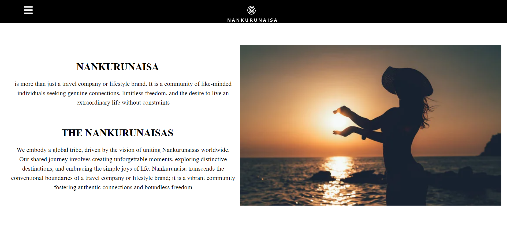
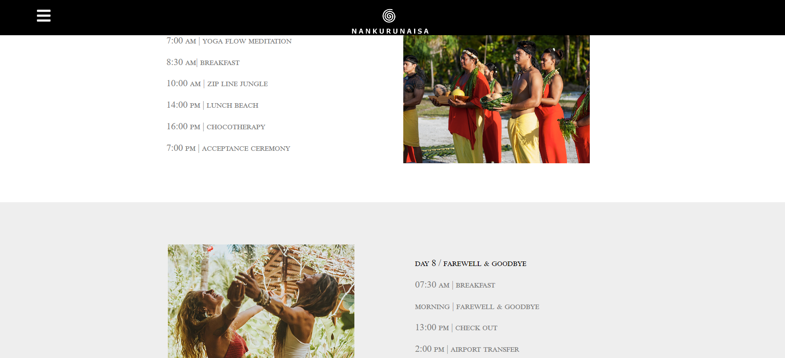

# GeeksHubs 

<a>Proyecto Final- FRONTEND Nankurunaisa.</a>

## Tabla de contenidos

- [Descripción 📝](#Descripción)
- [Tecnologías - Bibliotecas - Herramientas 🛠️](#Tecnologías-y-Bibliotecas-Herramientas)
- [Instalación 🚀](#Instalación)
- [Vistas-Componentes ⛏️⚙️](#Vistas-Componentes)
- [Contribuciones 🤝](#Contribuciones)
- [Licencia y Copyright📃](#licencia-y-copyright)

## Descripción

Este Frontend completa el Backend realizado para el retiro espiritual **NANKURUNAISA**. Permite a los usuarios (clientes, personal assistants y administradores) programar, modificar, mostrar y eliminar citas.Permite también la creación y eliminación de reservas de estancias en los retiros espirituales. Además, proporciona funciones de autenticación y autorización para garantizar la seguridad de los datos, así como una vista detallada del estudio, sus tatuadores y trabajos realizados.

## Tecnologías-Bibliotecas-Herramientas

- **Node.js** 
- **Vite** 
- **React** 
- **Axios** 
- **JWT para autenticación** 
- **Bcrypt para el hashing de contraseñas** 
- **Font Awesome** 
- **Visual Studio Code** 
- **Github** 
- **Git** 

## Instalación

1. Clona el repositorio: `git clone <url>`
2. Instala las dependencias: `npm install`

Si quieres acceder con el usuario admin:

  ```bash

    "email":"admin@admin.com"
    "password":"Prueba1!"
   ```

## Vistas - Componentes

### Home

<p align="center">
  
</p>

<p align="center">
  
  
</p>

**Home** es la vista principal, desde donde se puede acceder a las diferentes partes de la página.

**Header** es interactivo, desplazando al usuario por la página, permitiendo acceder, registrar o cerrar sesión. Se encuentran las opciones de Login/Logout y Register para que el usuario pueda interactuar. Una vez que se ha accedido mediante el login, aparecerá **PROFILE** y **ADMIN**, esta última opción en caso de que se acceda con la cuenta del admin de **NANKURUNAISA**.

<p align="center">
  
  
</p>

**Explore Our Destinations**

Aparecen 3 imágenes, cada una de ellas los destinos posibles de **NANKURUNAISA**. A través de ellos podrás acceder a la información y contenido. Por el momento **SVALGAROR** se encuentra en proceso de construcción.

<p align="center">
  
  
  
</p>

El carousel propio que se desplaza cada 1.5s o mediante teclado. Pulsado sobre la imagen se paraliza el movimiento del carousel. La barra de movimiento permite desplazar de forma automática.

El **Footer** tiene un formulario para rellenar tus datos y formar parte de **NANKURUNAISA**. Debes rellenar tanto el nombre como el email de forma correcta según la validación creada.

## Login - Register

<p align="center">
  
  
</p>

En caso de no introducir un email y una contraseña que cumplan con los requisitos, aparecen mensajes de alerta. Esto también sucede en el caso del register.

<p align="center">
  
  
</p>

Una vez registrado, se debe hacer login para poder acceder. Aparecerá un mensaje de bienvenida posteriormente.

Desde **Login** puedes ir directamente a **Register** pulsando **Sing Up** y de forma contraria pulsando **Log In**.

## Profile - Admin

<p align="center">
  
</p>

En **profile** aparecen los datos recibidos del token una vez que el usuario hace login. Aquí el customer y el personal assistant tendrán la posibilidad de pedir citas. El admin lo hará en una vista exlusiva para él.

<p align="center">
  
</p>

Las citas existentes para el usuario que haya hecho **Login** estarán también en este apartado. Desde aquí podrán ser editadas, eliminadas -borrado lógico- y reactivadas en caso de así desearlo.

<p align="center">
  
</p>

En cuanto al **Admin**, tiene su vista personal que aparece en el **Header** una vez que este ha hecho **Login**.

1. Podrá crear citas para customer y personal assistants, al igual que podrá conocer todas las citas existentes en **NANKURUNAISA**.
2. Podrá ver todos los usuarios registrados, así como realizar búsqueda por nombre, por role y de forma ASC y DSC.
3. Podrá crear reservas para los retiros espirituales. Esta funcionalidad por el momento se encuentra reservada al admin. Las reservas solo pueden crearse, listarse y eliminarse. Por protocolos de empresa no se permite su modificación.

<p align="center">
  
  
  
</p>


### Destinations

A día de hoy **NANKURUNAISA** cuenta con dos destinos totalmente habilitados, siguiendo ampliando en el futuro.

Se puede acceder a ellos a través del **Header** o de los diferentes enlaces que encontrarás en la página.

## Palaos

Parte de lo que podrás encontrar.

<p align="center">
  
  
  
</p>

Las imágenes tienen texto que aparece una vez que te posicionas sobre ellas.

Desde aquí también podrás acceder al planning de **Palaos**

<p align="center">
  
  
</p>

Y conocer mucho más de lo que hay en **NANKURUNAISA**

<p align="center">
  
</p>

## Boa Vista

Parte de lo que podrás encontrar.

<p align="center">
  
  
  
</p>

Desde aquí también podrás acceder al planning de **Boa Vista**. 

Encontrarás toda la información necesaria. El carousel es interactivo y puedes desplazarlo de forma manual. 

<p align="center">
  
</p>

<p align="center">
  
</p>

## Contribuciones

Las contribuciones son bienvenidas. Si encuentras algún problema o tienes una mejora, ¡no dudes en abrir un problema o enviar un pull request!

## Licencia y Copyright

Este proyecto pertenece a **Ángel Díaz Calleja** y ha sido creado como proyecto del Bootcamp Full Stack Developer de GeeksHubs Academy.


